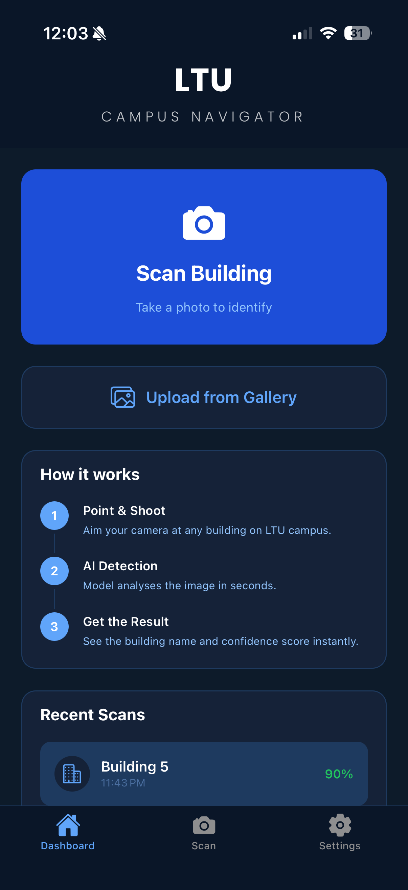
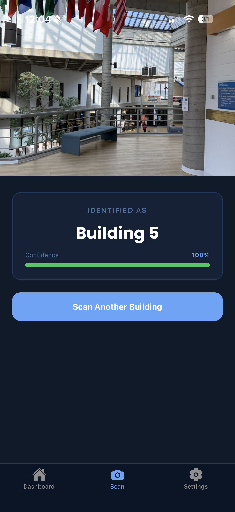
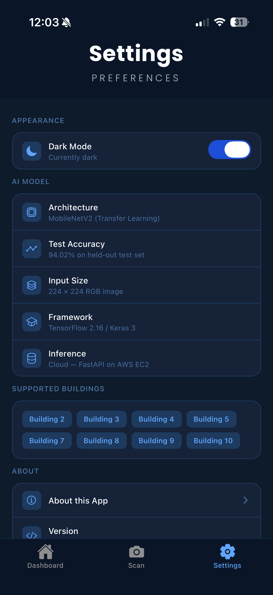
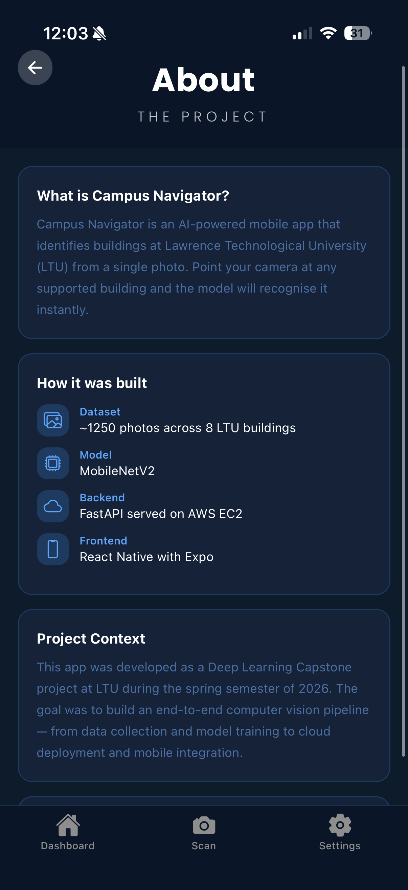

# Campus Navigation Mobile App using Computer Vision

A mobile application that identifies LTU campus buildings from a photo using a MobileNetV2 deep learning model, deployed as a REST API on AWS EC2.

---

## Project Overview

New students and visitors often struggle to navigate a university campus where buildings look similar or are interconnected. This project addresses that by letting the user take a photo of any building — the app sends it to a trained CNN model and returns the building name and a confidence score in seconds.

---

## System Architecture

```
iPhone (Expo app)
      │  POST /predict  (multipart image)
      ▼
FastAPI server  ──►  MobileNetV2 model  ──►  JSON { building, confidence }
(AWS EC2, Docker)
```

1. User opens the app and points the camera at a building
2. App sends the image to the FastAPI backend
3. Model runs inference and returns the predicted class + confidence
4. App displays the result with a colour-coded confidence bar

---

## Technologies

| Layer | Stack |
|---|---|
| Mobile app | React Native, Expo Router, NativeWind (Tailwind) |
| ML model | TensorFlow / Keras — MobileNetV2 transfer learning |
| Backend | FastAPI, Uvicorn, Pillow |
| Deployment | Docker, AWS EC2, Elastic IP |

---

## Model

- Architecture: MobileNetV2 (pretrained on ImageNet, fine-tuned on campus data)
- Input: 224 × 224 RGB image
- Classes: Building 2, 3, 4, 5, 7, 8, 9, 10
- Test accuracy: **94.02%**

---

## Dataset

Images collected on LTU campus with an iPhone under varying conditions:

- Different angles and distances
- Daytime and evening lighting
- Partial occlusions and people in frame

---

## Repository Structure

```
backend/        FastAPI server + Dockerfile
MobileApp/      React Native / Expo app
notebooks/      Model training and EDA notebooks
src/            Preprocessing and visualisation utilities
images/         App screenshots
```

---

## Screenshots

<p align="center">
  
  
  
  
</p>

---

## Running Locally

See [`backend/`](backend/) for server setup and [`MobileApp/`](MobileApp/) for the app setup.

---

## Take-home Assignment Disclaimer

- **Author Name:** Adam Najajreh (LTU ID: 000813397)
- **Work Ownership:** This work is my own. It is not a copy from someone: Yes
- **GenAI Assistance:** Percentage of code generated with AI tools: **50%** (AI assisted with debugging, and generated most of the React Native UI components and styling work)
- **Understanding:** I understand every part of this code: Yes
- **Confidence:** I am confident that I can modify, adapt, and extend this code on my own: Yes
